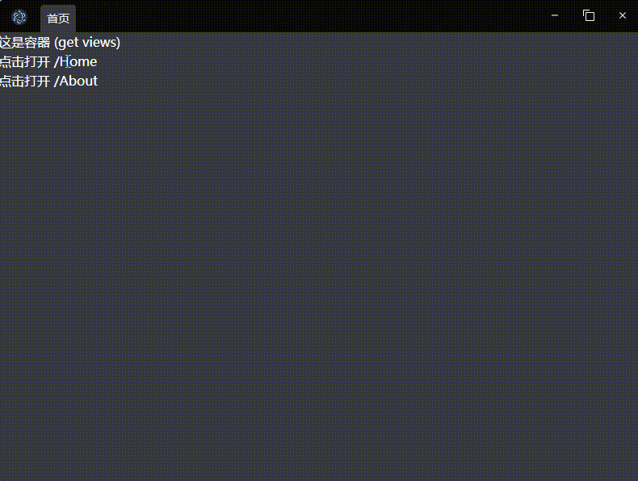

# electron-tabs

基于`electron-vite-vue`模板开发的electron多标签页应用Demo

## 预期效果
类似Chrome浏览器，不同页面对应一个单独的tab页，可自由切换。并且支持拖拽排序、拖拽新建窗口

## Preview


## Setup
```bash
npm install
npm run dev
```

## 实现方式
利用BrowserView相对与父级定位特性，在一个BrowserWindow窗口中添加多个BrowserView，通过控制不同BrowserView的显示/隐藏，来实现Tab页切换。

> BrowserView 被用来让 BrowserWindow 嵌入更多的 web 内容。 它就像一个子窗口，除了它的位置是相对于父窗口。 这意味着可以替代webview标签.
```js
const win = new BrowserWindow({ width: 800, height: 600 })

const view = new BrowserView()
win.setBrowserView(view)
view.setBounds({ x: 0, y: 0, width: 300, height: 300 })
view.webContents.loadURL('https://electronjs.org')
```

## TODO:
- [ ] tab拖拽排序
- [ ] 拖拽tab到窗口外，新建一个窗口
- [ ] 拖拽tab到另一个窗口的tab上，移动view
- [-] Tab Loading状态
- [-] Tab 进度条
- [-] 基于Route自动显示Tab标题及图标
