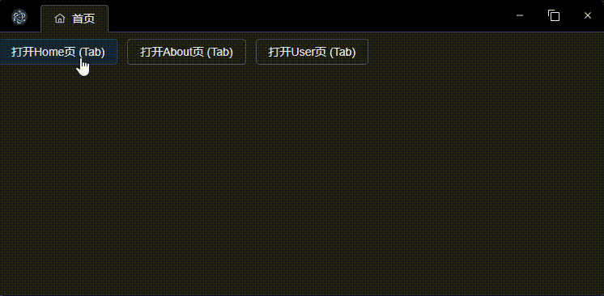

# electron-tabs

基于`electron-vite-vue`模板开发的electron多标签页应用Demo

## 预期效果
类似Chrome浏览器，不同页面对应一个单独的tab页，可自由切换。并且支持拖拽排序、拖拽新建窗口

## Preview


## Setup
```bash
npm install
npm run dev
```

## 实现方式
利用BrowserView相对与父级定位特性，在一个BrowserWindow窗口中添加多个BrowserView，通过控制不同BrowserView的显示/隐藏，来实现Tab页切换。

> BrowserView 被用来让 BrowserWindow 嵌入更多的 web 内容。 它就像一个子窗口，除了它的位置是相对于父窗口。 这意味着可以替代webview标签.
```js
const win = new BrowserWindow({ width: 800, height: 600 })

const view = new BrowserView()
win.setBrowserView(view)
view.setBounds({ x: 0, y: 0, width: 300, height: 300 })
view.webContents.loadURL('https://electronjs.org')
```
## 使用说明
### 添加Tab页、显示Loading、显示进度条、更新Tab内容
```ts
import { createTab, updateTabSate, updateTabs } from "@/components/PageTabs/utils";

// 创建tab页
createTab(path)

// 显示Loading
updateTabSate({loading: true})

// 显示进度条(显示进度条时，必须设置loading: true)
updateTabSate({progress: 0.5, loading: true})

// 更新Tab内容, 一般用于view路由变化后，更新tab标题及图标
router.push('/Home').then(() => updateTabs())
```

### Tab 标题及图标说明
通过url参数、route.meta、route.name等属性，自动生成tab标题及图标（按优先级排序）：
1. `route.query.title`
2. `route.query.name`
3. `route.meta.title`
4. `route.path`
```ts
// path 是BrowserView的路由地址，如：/Home
// view.webContents.getURL().replace((app.isPackaged ? INDEX_HTML : ROOT_URL) + '/#', '')
const path = '/Home'
const route = router.resolve(path)
const { title, name } = route.query
return {
  ...item,
  title: !path && loading ? '加载中...' : (title || name || route?.meta?.title || path) as string,
  icon: route.meta?.icon
}
```
Routes示例
```ts
import { RouteRecordRaw } from 'vue-router';
import UserPage from '../pages/User.vue';
import { User } from '@vicons/carbon';

const routes: RouteRecordRaw[] = [
  { 
    path: '/User', 
    component: UserPage, 
    meta: { title: 'User页', icon: shallowRef(User) }
  },
]

export default routes
```

## TODO:
- [ ] tab拖拽排序
- [ ] 拖拽tab到窗口外，新建一个窗口
- [ ] 拖拽tab到另一个窗口的tab上，移动view
- [x] 根据路由自动生成tab标题及图标
- [x] Tab Loading状态
- [x] Tab 进度条
- [x] 基于Route自动显示Tab标题及图标
